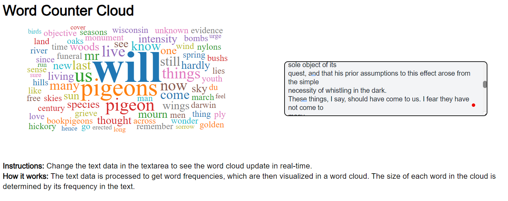

# Word Cloud Generator in Next.js with TypeScript

A dynamic word cloud generator built with Next.js, TypeScript, and React. This project visualizes the most frequent words in a given text dataset using a customizable and responsive word cloud component.



## Table of Contents

- [Features](#features)
- [Getting Started](#getting-started)
  - [Prerequisites](#prerequisites)
  - [Installation](#installation)
  - [Running the App](#running-the-app)
- [Technologies Used](#technologies-used)

---

## Features

- **Dynamic Font Sizing and Weight**: Adjusts font size and weight based on word frequency.
- **Customizable**: Easy to change fonts, colors, and other styling options.
- **Responsive Design**: Scales well on different screen sizes.
- **Simple Tokenization**: Processes raw text data into word frequencies without external dependencies.

---

## Getting Started

### Prerequisites

- **Node.js** (v14 or later)
- **Yarn** (Package manager)
- **Git** (optional, for cloning the repository)

### Installation

1. **Clone the Repository**

   ```bash
   git clone https://github.com/yourusername/word-cloud-app.git
   cd word-cloud-app
   ```

2. **Install Dependencies**

   ```bash
   yarn install
   ```

### Running the App

**Development Mode**

Start the development server:

```bash
yarn dev
```

Open [http://localhost:3000](http://localhost:3000) in your browser to view the app.

**Production Build**

To build the app for production:

```bash
yarn build
```

Start the production server:

```bash
yarn start
```

---

## Technologies Used

- **Next.js**: React framework for server-side rendering and static site generation.
- **TypeScript**: Superset of JavaScript adding static typing.
- **React**: JavaScript library for building user interfaces.
- **react-d3-cloud**: React component for rendering word clouds using D3.js.
- **Yarn**: Package manager for installing dependencies.

---

## Troubleshooting

### Common Issues

- **Module Not Found Errors**: Ensure all dependencies are installed correctly. Run `yarn install` to install missing packages.
- **SSR Issues with `react-d3-cloud`**: If you encounter issues related to server-side rendering, make sure `react-d3-cloud` is imported dynamically with `ssr: false`.

  ```tsx
  import dynamic from 'next/dynamic';

  const WordCloud = dynamic(() => import('react-d3-cloud'), { ssr: false });
  ```

- **Port Already in Use**: If port 3000 is already in use, the app will try the next available port (e.g., 3001). You can specify a different port when starting the dev server:

  ```bash
  yarn dev -p 3005
  ```

---

## Additional Resources

- [Next.js Documentation](https://nextjs.org/docs)
- [TypeScript Documentation](https://www.typescriptlang.org/docs/)
- [React Documentation](https://reactjs.org/docs/getting-started.html)
- [react-d3-cloud GitHub Repository](https://github.com/Yoctol/react-d3-cloud)
- [D3.js Documentation](https://d3js.org/)

---

## Notes

- **Custom Tokenization**: Instead of relying on external libraries, the project uses a simple tokenizer with a custom stopword list to ensure compatibility and reduce dependencies.
- **Server-Side Rendering**: Care has been taken to ensure compatibility with Next.js's SSR features by dynamically importing client-side only libraries.
